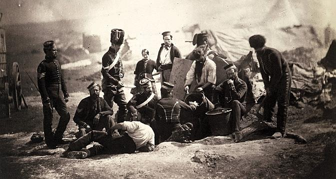
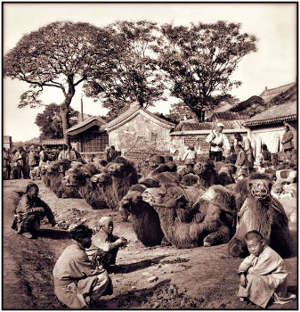
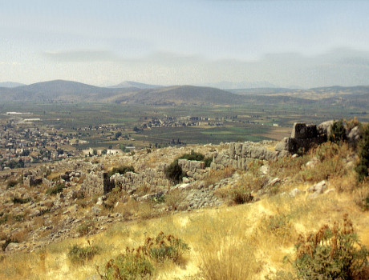

# L'histoire de Schliemann

###### *Produit avec reveal.js*

# Qui est-ce?
[//]: <> ( diaop 1 )

# Les origines
[//]: <> ( diaop 2 )
### D'ou vient-il?

# La fortune
[//]: <> ( diaop 3 )

## Saint-Petersbourg (1846)
[//]: <> ( diaop 4 )

## Californie (1850)
[//]: <> ( diaop 5 )

## Retour en Russie (1855)
[//]: <> ( diaop 6 )

# Installation à Paris (1861)

## Entrée à la Sorbonne

Etudiera : 
 - les sciences de l'antiquité
 - les langues orientales

# Voyages

## Egypte

## Inde

## Japon

## Chine

## Grece

# Langues

 - le francais
 - l'hollandais
 - l'espagnol
 - l'italien
 - le portugais
 - l'arabe
 - le russe

# Fouilles 

Début en 1870 en grèce et en asie mineure.

## Troie
Il réalisa son rêve d'enfance et découvrit Troie sur une butte d'Hissarlik en Turquie.

## Mycene

## Orchomene

## Tyrinte

Tout ces sites furent decouvert en une douzaine d'annees.

# Fin

Il mourut en 1890 à l'age de 68 ans.

Il est enterre au premier cimetiere d'Athene